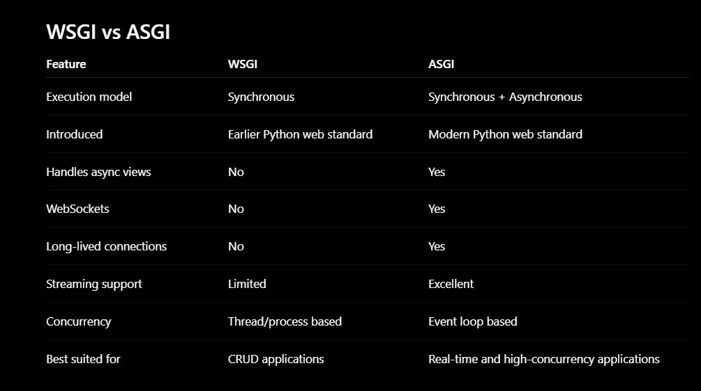

# Django

## Basics of python
### Decorators
#### Function Decorators
    A function that extends the behaviour of other function without modifying the base function
    pass the base function as an argument to the decorator.
        def add_sprincles(func): #Decorator function
            def wrapper():
                print("Add sprincles here!!")
                func()
            return wrapper
        
        @add_sprincles
        def get_ice_cream(): # Base function
            print("Here is the icecream")
            
        get_ice_cream()
        
    Step1) write a function to accept a function as argument
    Step2) write a function adding extra features in it
    Step3) return the current function that we had created
    Step4) now add @function name that we had created 
    Step5)execute the funtion normally

    Given two numbers, convert them into integer type and return the sum
    Code:
        def convert_ints(add):
            def inner_function(a,b): # It is required since decorator needs function
                a = int(a)
                b = int(b)
                return add(a,b) # Required since i need add is returing
            return inner_function
        
        @convert_ints
        def add(a,b):
            return a+b
        
        c = add(4.5, 5)
        print(c)
        # Decorator with arguments
        def convert_args(method): # Takes decorator arguments
            def wrapper(add): # Takes function has argument
                def inner_function(a,b): # Arguments of the function
                    if(method=="int"):
                        a = int(a)
                        b = int(b)
                        return add(a,b)
                return inner_function
            return wrapper
        
        
        @convert_args("int")
        def add(a,b):
            return a+b
            
        print(add(4.5, 5))
        
### Annotations
    # Annotations are used to get warnings in the code editior and code suggestions
    # Annotations doesnot manuplate the code
    # Better readability: Other developers can understand what types a function expects
    # Documentation: Annotations act as self documenting code
    
    class Car:
        def __init__(self, name: str, price: int) -> None:
            self.name = name
            self.price = price
    
        def get_info(self) -> None:
            print(f"{self.name} is at {self.price}")
        
        def __str__(self):
            return f"{self.name}"
    
    
    car_obj: Car = Car("abc", 1244)
    car_obj.get_info()
    print(car_obj)

## Introduction
### How Django application works
    When ever an http request has been passed to the url. The request has been passed to appropriate view. The view will read or write data along with template it is displayed to user.
    professional:
        When a client sends an HTTP request, it first reaches the web server, which forwards it to Django. Django's URL dispatcher (urls.py) matches the request URL to the appropriate view. The view contains the business logic and may interact with models to read or write data in the database using Django ORM. The retrieved data can then be passed to a template to generate HTML, or returned directly as JSON for APIs. Finally, the view returns an HTTP response, which Django sends back to the client.
    URL - Http request uses URL Mapper to send data to corresponding view.
    View - A view receives Http request, access data via models and returns http response.
    Modals - Modals are python objects defining applications data structures. They also provide create, edit and query records in the database.
    Template - Templates define the structure of a file layout to represent data in the web page.
    An application aka app is the functional unit of the project. To create a app within the project we use the command
    python manage.py startapp poll
    this will create a application named poll with the skeleton folder structure to represent all the framework elements.
    Django clients - facebook, instagram, bitbucket, pinterest.
### How django urls works
    Django follows the following algorithm to serve any user request.
        Determine the root URLconf module to use.
        Load the Python module urls and look for the variable urlpatterns.
        Check each URL pattern in order, and stop at the first pattern match.
    Based on the pattern match, call the corresponding view with the following arguments:
        HttpRequest instance
        Named groups or positional arguments
        Keyword arguments
    Error handling views are called if no URL pattern matches, or if an exception is raised.
### URL patterns
    In the urlpattern each pattern is written using path or re_path functions.
    angled patterns are used to capture a value from the url
        apps/<int:age>/
    Captured values can be converted to string or other datatypes like int or slug.
    Upon a url match with the corresponding view function is called to action.
    apps/2018/, views.2018_view
    apps/<int:year>/, views_second_view
    2018_view is the first matched view this will be called.
    Convert this url to pattern match url
        apps/2018/02/hello world/
        apps/<int:year>/<int:month>/<slug:slug>/
    consider a user request app/201888/ technically it is wrong.
    we can use python regular expressions using re_path function
        syntax:
            (?P<name>Pattern)
            (?P<year>[0-9]{4})
            Use case:
                article/(?P<year>[0-9]{4})/
                only article/2018/ valid article/201888/ invalid
    Type converstions are not allowed all the values are sent as the strings
### Reversing the url
    Views using a custom Python function reverse
    Templates using the url template tag
    Model instances using get_absolute_url method.
### API - Application Programming Interface
    It is a set of protocals and tools that allows different applications to communicate each other. Apis enables us to create a complex applications by leveraging existing functionalities.
    Private APIs - within org, Partnered - Business, Public - 3rd party developer
    Since we are communicating with different application we need a common language that is JSON, or xml
### Urls in the django
    https://amazon.com/movies/reviews/

    Base Url : https://amazon.com/
    endpoint: movies/reviews

    Different kinds of urls
    https://amazon.com/movies/127/
    https://amazon.com/movies/127/reviews/
    https://amazon.com/movies/127/reviews/?limt=20
### Rest Api
    Representational State Transfer
    Rest is an architectural style.  
    Fouses on 1)endpoints 2)Methods(CRUD) - Create(Post), Read(Get), Update(Put), Delete(Delete) 3)headers 4)data
### Why do we need virtual enviroment
    Virtual evironment is a isolated environment where we can install multiple packages to run the application without installing in the system.
    Suppose I need iam working in project 1 where i require python 2.1 and pandas to run the application i need to create virtual env 1
    if i want to work on other project 2 where i require python 3.7 i can use this in virtual env 2
## Create Modal in django
    from django.db import models
    class Movie(models.Model):
        name = models.CharField(max_length=30)
        description = models.TextField(max_length=200)
        active = models.BooleanField(default=True)

        def __str__(self):
            return self.name
    Register in the admin
    from django.contrib import admin
    from .models import Movie
    admin.site.register(Movie)
    I can see the admin the browser http://localhost:8000/admin/
## Creating a view using JsonResponse
    from django.http import JsonResponse
    from .models import Movie
    class MoviesList(request):
        movies = Movies.objects.all()
        return JsonResponse({"movies":list(movies.values())}) # since JsonResponse require dictonary we have converted queryset to normal set and made key value pair

    In the urls add this
    urlpatterns = [
        path("movies/", movie_list, name="list-movies")
    ]
## How queryset works
    queryset is a special type of list that is used by django for faster retrival.
    movies = Movie.objects.all()
        Querset [<Movie:RRR>, <Movie:Kalki>]
        Since we have used self.name as return for __str__ during database creation
    movies = Movie.objects.all().values()
        Queryset [{name:"RRR", description:"Hello", active:true}, {...}]
    Convert queryset to normal list
    data = list(Movie.objects.all().values())

    How filter or get method works
    movie = Movie.objects.all().filter(name=name).first()
        # Now movie is not query set it is an object if i want to pass to JsonResponse i need to make it as dictionary
    data = {"name":movie.name, "description":movie.description, "active":movie.active}

    Note:
        A QuerySet contains model instances (e.g., [<Movie: RRR>, <Movie: Kalki>]), which cannot be directly returned as JSON because model instances are not JSON serializable. We pass the QuerySet to a serializer, which converts each model instance into Python dictionaries containing primitive data types. These primitive data types are then rendered as JSON in the HTTP response.

        Interview explanation:
        A QuerySet contains Django model instances, which are not JSON serializable. The serializer converts these model instances into Python primitive data types like dictionaries and lists. Finally, Django REST Framework's renderer converts those primitive data types into JSON before sending the HTTP response. Validation is performed by the serializer only when deserializing input data (e.g., during POST, PUT, or PATCH requests).

### Query params and path params
    path params are mandatory fields to access the view, query params are optional
    urlpatterns = [
        path("products/<int:product_id>/", ProductView.as_view()), #Path param
        path("orders/", OrderView.as_view())
    ]
    path param view
        http://localhost:8000/product/1/
        class ProductView(APIView):
            def get(self, request, product_id=None):
                print(product_id)
    query param view
        http://localhost:8000/orders/?username=koushik&password=koushik
        class OrderView(APIView):
            def get(self,request):
                name = self.GET.get("username", None)
                password = self.GET.get("password", None)

## When to use .save() method
    If we are dealing with model instance and changes need to there in db then we can use .save() method
    Create a product in db:
        1.Create product model instance and save it
            product = Product(name="bottle",price=23, quantity=5)
            product.save() 
        2.Use create method
            Product.objects.create(name="bottle", price=23, quantity=5)
            Note: create() internally creates a model instance and calls .save().

    Updating the product
        1. Using model instance and call save
            product = Product.objects.get(name="bottle")
            product.name = "bottle2"
            product.price = 20
            product.quantity = 10
            product.save()
        2.Use update method
            product = Product.objects.filter(name="bottle").update(name="bottle2", price=20, quantity=10)
            Note:
                update() is a QuerySet method, not a model instance method.
                It executes a direct SQL UPDATE.
                It does not call .save().
                It does not trigger save() overrides or pre_save/post_save signals.

    Delete method:
        product = Product.objects.get(name="bottle")
        product.delete()
        Note: delete() removes the record from the database. It does not use .save().

# Sample CRUD operation on user table with out serializers
    Note:
        create, update, delete internally uses save method
        if we are interacting with model then only we can use .save method

    code in the view file
    class UserData(APIView):
        permission_classes = []
        authentication_classes = []
    
        def get(self, request):
            user_data = User.objects.all().values() # By using values we are already converting queryset to python dictionaries that are serializable
            return Response({"message": user_data})
    
        def post(self, request):
            username = request.data.get("username", None)
            password = request.data.get("password", None)
            name = request.data.get("name", None)
            email = request.data.get("email", None)
    
            if not username:
                return Response({"error": "Please enter username"}, status=400)
            if not password:
                return Response({"error": "please enter password field"}, status=400)
    
            user_obj = User.objects.create(username=username, name=name, email=email)
            user_obj.set_password(password)
            user_obj.save()
    
            return Response({"message": "Created User"}, status=201)
    
        def put(self, request):
            username = request.data.get("username", None)
            password = request.data.get("password", None)
            name = request.data.get("name", None)
            email = request.data.get("email", None)
    
            if not username:
                return Response({"error": "Please enter username"}, status=400)
            if not password:
                return Response({"error": "please enter password field"}, status=400)
    
            try:
                user_obj = User.objects.get(username=username)
                user_obj.username = username
                user_obj.name = name
                user_obj.email = email
                user_obj.set_password(password)
                user_obj.save()
            except User.DoesNotExist:
                return Response({"message": "User not found"}, status=404)
    
            return Response({"message": "Updated user successfully"}, status=200)
    
        def delete(self, request, username=None):
            if not username:
                return Response({"error": "please pass username from params"}, status=400)
            user_obj = User.objects.filter(username=username).first()
            if not user_obj:
                return Response({"error": "User not found"}, status=404)
            user_obj.delete()
    
            return Response({"message": "deleted successfully"}, status=200)
    
    
    @api_view(["GET"])
    @authentication_classes([])
    @permission_classes([])
    def login(request):
    
        username = request.GET.get("username", None)
        password = request.GET.get("password", None)
    
        if not username or not password:
            return Response({"error": "Enter username and password"})
    
        user_obj = User.objects.filter(username=username).first()
        if not user_obj:
            return Response({"error": "Username doesnot exist"})
        user_obj.check_password(password)
    
        return Response({"message": "Logged in successfully"}, status=200)
    Code in the url folder:
        path("userdata/", UserData.as_view(), name="userdetails"),
        path("userdata/<str:username>/", UserData.as_view(), name="individual_userdetails"),

    
## Serialization
### Why we need serialization
    To convert complex datastructures to python native and then to json
    Earlier we used to convert querysets into dictionaries and later i need to send it as json
    Instead of the manual work we can use serializer that reduces our work
    
### Types of Serializers and views
    Serializers -
        serializers.Serializer
        serializers.ModelSerializer
    views - 
        function views
        class based views
            Generic Views
            Mixins
            Concrete View Classes
            ViewSets
#### serializers.Serializer
    from rest_framework import serializers

    class MovieSerializer(serializers.Serializer):
        id = serializers.IntegerField(read_only=True)
        name = serializers.CharField()
        description = serializers.CharField()
        active = serializers.BooleanField()
    How to use ?
    in the views file add this
    Code:
        class Movies(APIView):
            def get(self, request, name=None):
                if name is not None:
                    movies = Movie.objects.all().filter(name=name).first()
                    if movies is None:
                        return Response({"error": "No movie with the title exists"})
                    serialized_movies = MovieSerializer(movies) # Passing complex data like queryset here iam passing object
                    return Response(serialized_movies.data) # Directly passing the value
        
                movies = Movie.objects.all()
                serialized_movies = MovieSerializer(movies, many=True) ## Dont forgot to add this for multiple values of the serializers
                return Response({"movies": serialized_movies.data})
#### Model Serializer
    Code:
    from rest_framework import serializers
    from .models import Movie
    
    class MovieSerializer(serializers.ModelSerializer):
        class Meta:
            model = Movie
            fields = ["id", "name", "description", "active"] or fields = "__all__" or exclude = ["id"]
    In the views usage there is no difference between serializer and model serializer
### CRUD operations and there serializers
    Serializers Code:
        from rest_framework import serializers
        from .models import Movie
        
        class MovieSerializer(serializers.ModelSerializer):
            class Meta:
                model = Movie
                fields = ["id", "name", "description", "active"]
            
            def create(self, validated_data):
                return Movie.objects.create(**validated_data)
            
            def update(self, instance, validated_data):
                instance.name = validated_data.get("name", instance.name)
                instance.description = validated_data.get("description", instance.description)
                instance.active = validated_data.get("active", instance.active)
                instance.save()
                return instance
    Views Code:
        class Movies(APIView):
        def get(self, request, name=None):
            if name is not None:
                movies = Movie.objects.all().filter(name=name).first()
                if movies is None:
                    return Response({"error": "No movie with the title exists"})
                serialized_movies = MovieSerializer(movies)
                return Response(serialized_movies.data)
    
            movies = Movie.objects.all()
            serialized_movies = MovieSerializer(movies, many=True)
            return Response({"movies": serialized_movies.data})
        
        def post(self, request):
            data = request.data
            serializer = MovieSerializer(data=data)
            if serializer.is_valid():
                serializer.save()
                return Response({"Message": "Added movie successfully"}, 201)
        
        def put(self, request, name=None):
            if name is None:
                return Response({"error": "Please pass the updated movie name int the params"})
            movie = Movie.objects.all().filter(name=name).first()
            serializer = MovieSerializer(movie, data=request.data)
            if serializer.is_valid():
                serializer.save()
                return Response({"Message": "Updated Successfully", "data": serializer.data})
            else:
                return Response(serializer.errors)
        
        def delete(self, request, name=None):
            if name is None:
                return Response({"error": "Please pass the name to delete"})
            movie = Movie.objects.all().filter(name=name).first()
            if movie is None:
                return Response({"error": "Movie name doesnot exist"})
            movie.delete()
            return Response({"Message": "Deleted Successfully"})
### Validations in serializer
    Code:
        # Field level validation
        # Here naming convention is important validate_fieldname
        def validate_name(self, value):
            if(len(value)<2):
                raise serializers.ValidationError("Name is too short")
            return value
        
        # Object level validation
        def validate(self,data):
            if(data.get("name") == data.get("description")):
                raise serializers.ValidationError("name and description should not be same")
            return data
### Custom fields in serializer and entire serializer code
    Code:
        from rest_framework import serializers
        from .models import Movie
        
        class MovieSerializer(serializers.ModelSerializer):
            # Adding custom field that is not present in the model
            # Step1)
            len_name = serializers.SerializerMethodField()
        
            class Meta:
                model = Movie
                fields = ["id", "name", "description", "active", "len_name"]
            
            # step2) Adding functionality to custom field
            def get_len_name(self, object):
                return len(object.name)
            
            def create(self, validated_data):
                return Movie.objects.create(**validated_data)
            
            def update(self, instance, validated_data):
                instance.name = validated_data.get("name", instance.name)
                instance.description = validated_data.get("description", instance.description)
                instance.active = validated_data.get("active", instance.active)
                instance.save()
                return instance
            
            # Field level validation
            def validate_name(self, value):
                if(len(value)<2):
                    raise serializers.ValidationError("Name is too short")
                return value
            
            # Object level validation
            def validate(self,data):
                if(data.get("name") == data.get("description")):
                    raise serializers.ValidationError("name and description should not be same")
                return data
### Nested Relation in serializer
    Consider this example a streaming platform contains many movies but one movie can be on one platform
    Plaform - many movies
    Movie(watchlist) - one platform

    In the watchlist table platform is a foreign key given below is the model
    Code:
        class WatchList(models.Model):
            streamingplatform = models.ForeignKey(StreamPlatform, on_delete=models.CASCADE, related_name="watchlist") # Related name is important
            title = models.CharField(max_length=50)
            description = models.CharField(max_length=200)
            active = models.BooleanField(default=True)
            created = models.DateTimeField(auto_now_add=True)
        
            def __str__(self):
                return self.title

    Now my question is how to get all the movies of the all platforms
    Example: amazon can have RRR, sahoo etc
    To get this we need to modify serializer of the Platform
    Code:
        class StreamPlatformSerializer(serializers.ModelSerializer):
            watchlist = WatchListSerializer(many=True, read_only=True) # same related name is used here
            class Meta:
                model = StreamPlatform
                fields = "__all__"
        Instead of getting entire object we can get only strings 
                watchlist = serializers.StringRelatedField(many=True, read_only=True) # To get only strings
                watchlist = serializers.PrimaryKeyRelatedField(many=True, read_only=True) # To get only primary key
## Mixins
    Mixins are very popular to perform very common tasks.
    All we need is to provide a basic settings and we can use common methods and perform all this common tasks very quickly

## ORM in django
    Suppose i have a DesignMaster table that has project has foreign key relationship and RoofDesignMap is the many to many relation.
    Models for both the tables:
        class DesignMaster(BaseModel):
            design_number = models.CharField(max_length=50)
            project = models.ForeignKey(Project, on_delete=models.CASCADE)
            version = models.FloatField(null=True)
            is_completed = models.BooleanField(default=False, null=False)
            is_default = models.BooleanField(default=False, null=False)
            roof_details = models.ManyToManyField(
                "RoofMaster", through=RoofDesignMap, null=True
            )
            location = models.ForeignKey(
                Location, on_delete=models.CASCADE, related_name="location", null=True
            )
            is_deleted = models.BooleanField(default=False)
        
            class meta:
                db_table = "design_master"

        class Project(BaseModel):
            project_number = models.CharField(max_length=10, null=False, unique=True)
            project_name = models.CharField(max_length=50, null=False)
            is_deleted = models.BooleanField(default=False, null=False)
            design_status = models.BooleanField(default=True, null=False)
            home_owner = models.ForeignKey(Customer, on_delete=models.CASCADE)
            default_design = models.ForeignKey(
                "DesignMaster",
                on_delete=models.CASCADE,
                null=True,
                related_name="default_design",
            )
        
            class Meta:
                db_table = "project_master"

    Queries with foreign Key relations:
        Q) Search based on project_name and return entire Design master row?
            DesignMaster.objects.filter(project__project_name="D-0001_JohnDoe878").values().first()
        Q) Filter using project_name in DesignMaster and return project data from the DesignMaster? (simply get the project from the desingMaster table)
            project_obj = DesignMaster.objects.select_related("project").filter(project__project_name="D-0001_JohnDoe878").first().project #Got project object
            print(project_obj.project_name)
        Q) Given design_number that is present in the DesignMaster retrive the project_obj?
            project_obj = DesignMaster.objects.filter(design_number="D-001").first().project
            project_obj.project_name
            Fail Cases:
            project_obj = DesignMaster.objects.filter(design_number="D-001").values().first().project #projectObj is only avaliable when the it is queryset here by using .values i have flatted the data into dictonaries now the projectObj is not avaliable
        Q) Extention to the above question get both designMaster object and projectObj
            design_obj = DesignMaster.objects.filter(design_number="D-001").first() #The only constraint is dont flatten it using values
            project_obj = design_obj.project
    Queries with many to many relationship:
        Q) Given DesignMaster and RoofMaster they are both having many to many relationship
        Q) Given Design_number find the all the associated roofsMaster rows?
            DesignMaster.objects.filter(design_number="D-093").first().roof_details.values() #This contains all the roofs associated in the form of list of dictnaries
            DesignMaster.objects.filter(design_number="D-093").first().roof_details.values_list("id") #This contains all the ids
        Q) extention to the above question, Give the pitch value of the first roof?
            first_roof = DesignMaster.objects.filter(design_number="D-093").first().roof_details.values().first()
            first_roof.get("pitch")
            For optimization we can use this
            first_roof = DesignMaster.objects.prefetch_related("roof_details").filter(design_number="D-093").first().roof_details.values().first() #roof_details is the key that connects the RoofMaster table
### Q (Complex queries)
    Q) Queries
        Since if we use .filter .filter that only performs only and operator, if i want to perform various filters i can use complex queries.
        from django.db.models import Q
        Project.objects.filter(Q(project_number="D-0020") | Q(project_number="D-0021") & Q(is_deleted=True)).values()
        Project.objects.filter(Q(project_number="D-0020") | (Q(project_number="D-0021") & Q(is_deleted=True))).values() 
        Project.objects.filter((Q(project_number="D-0020") | Q(project_number="D-0021")) & Q(is_deleted=True)).values()
    Q) F Expressions
        F expressions is the encapsulated sql of the database field.
        Using F expressions we can manuplate data in database
        Update multiple data at once
        Query:
            from django.db.models import F
            RoofMaster.objects.update(pitch=F("pitch")*10)
        Update Individual Row:
            roof = RoofMaster.objects.all().first()
            roof.pitch = F("pitch") + 2
            roof.save()
            RoofMaster.objects.all().values()

## ModelViewSet
    ModelViewSet simplifiles the boiler plate code by providing all the CRUD operations in it and it handles the routing as well
    Provides default create(), retrieve(), update(), partial_update(), destroy() and list() actions
    Step1) Create a serializer
    In the serializers.py file add this
        class UserSerializer(ModelSerializer):
            class Meta:
                model = User
                fields = ["username", "email", "id"]
    Step2) Create a view and add this
        ModelViewSet View needs two parameters one is queryset and serializer_class, permission_classes and authentication_classes are optional
        
        class UserData(ModelViewSet):
            queryset = User.objects.all()
            serializer_class = UserSerializer
            permission_classes = []
            authentication_classes = []
    Step3) Add this in the Urls
        First way
            from . import views
            from django.routers import DefaultRouter
            urlpatterns = []

            router = DefaultRouter()
            router.register("userdata", views.UserData)
            urlpatterns+=router.urls
        The other way
            from django.urls import path, include
            from .views import IndustryView
            from rest_framework.routers import DefaultRouter

            router = DefaultRouter()
            router.register("", IndustryView, basename="industry")

            urlpatterns = [
                path("industries/", include(router.urls)),
            ]

    Step4) Check the urls in the postman
        Get - http://localhost:8000/users/userdata/
        individual Data - http://localhost:8000/users/userdata/1/
        post - " , body needed
        put - http://localhost:8000/users/userdata/1/, body needed
        delete - http://localhost:8000/users/userdata/1/
    Additional Url like: Get users based on Industry id
        from rest_framework.decorators import action

        @action(detail=True, methods=["get"])
        def users(self, request, pk=None):
            industry = self.get_object()
            users = User.objects.filter(id=industry.owner_id)
            serializers = UserSerializer(users, many=True)
            return Response(serializers.data)
    
    Explained with simple example
    Create a viewset with products/ url and products/1/ url

        class ProductViewSet(ModelViewSet):
            queryset = Product.objects.all()
            serializer_class = ProductSerializer

            @action(detail=False, methods=["get"], permission_classes=[IsAuthenticated])
            def valid_products(self, request):
                products = self.get_queryset().filter(stock__gt=2)
                serializer = self.get_serializer(products, many=True)
                return Response(serializer.data)
        Url code:
            router = DefaultRouter()
            router.register("products", views.ProductViewSet)
            urlpatterns += router.urls
        
    By using action we are extending the base viewset with the own get url
    Now we can access valid_products via http://localhost:8000/products/valid_products/

            
## jwt Custom Authentication
    Steps1)
        Set Cookie in login
    Step2)
        Create Custom authenticaton and do this operations
        Steps:
           Check if the access_token is there in blacklisted if yes throw AuthenticationFailed
           Check if the access_token is given by us or not by checking in Outstanding tokens
           Using jwt decode
               if token valid 
                   return user, access_token
               if token is invalid throw token invalid exception
               if token expired
                   check if the refresh token is valid or not
                       if valid:
                           Blacklist the access_token and generate new access_token
                           return user, access_token
                        if token invalid:
                            throw signature expired exception
    Step3) Verify on any view
    Codes to implement Custom Authentication
    
    Step1)login.py
        @api_view(["GET"])
        @authentication_classes([])
        @permission_classes([])
        def login(request):
        
            username = request.GET.get("username", None)
            password = request.GET.get("password", None)
        
            if not username or not password:
                return Response({"error": "Enter username and password"})
            print(username, password, "******")
        
            user = authenticate(username=username, password=password)
        
            if not user:
                return Response({"error": "Invalid credentails"})
        
            # Generate and insert the token
            access_token, refresh_token = generate_token(user.id)
            insert_token(access_token, refresh_token)
        
            # Set cookies
            response = Response({"message": "Logged in successfully"}, status=200)
            response.set_cookie("access_token", access_token)
            response.set_cookie("refresh_token", refresh_token)
            return response
    Step2) CustomAuthentication.py
        from rest_framework.authentication import BaseAuthentication
        from rest_framework.exceptions import ValidationError
        from .utils import is_valid_token
        from rest_framework.exceptions import AuthenticationFailed
        from .models import BlackListedTokens, OutStandingTokens
        
        
        class CustomAuthenticaion(BaseAuthentication):
        
            def authenticate(self, request):
                excluded_paths = ["/swagger/"]
                if request.path in excluded_paths:
                    return None
        
                access_token = request.COOKIES.get("access_token", None)
                refresh_token = request.COOKIES.get("refresh_token", None)
        
                if not access_token:
                    raise AuthenticationFailed({"error": "please pass the access_token"})
                if not refresh_token:
                    raise AuthenticationFailed({"error": "please pass the refresh_token"})
        
                # Check is it black listed
                black_listed = BlackListedTokens.objects.filter(token=access_token).first()
                if black_listed:
                    raise AuthenticationFailed({"error": "Invalid/expired token"})
        
                # Check whether token is generated by the system
                valid_token = OutStandingTokens.objects.filter(token=access_token).first()
                if not valid_token:
                    raise AuthenticationFailed({"error": "Invalid Token"})
        
                user, access_token = is_valid_token(access_token, refresh_token)
        
                return user, access_token
    Step2.1)utils.py
        from demo.users.models import User
        from .models import OutStandingTokens, BlackListedTokens
        from django.conf import Settings
        import jwt
        from datetime import datetime, timedelta
        from rest_framework.exceptions import ValidationError
        from rest_framework import exceptions
        
        
        def insert_token(access_token, refresh_token):
            OutStandingTokens.objects.create(token=access_token, token_type="access_token")
            OutStandingTokens.objects.create(token=refresh_token, token_type="refresh_token")
        
        
        def generate_token(user_id):
            access_expiry = datetime.now() + timedelta(minutes=1)
            refresh_expiry = datetime.now() + timedelta(hours=7)
            access_token = jwt.encode(
                {"id": user_id, "iss": "demo application", "exp": access_expiry},
                "secret",
                "HS256",
            )
            refresh_token = jwt.encode(
                {"id": user_id, "iss": "demo application", "exp": refresh_expiry},
                "secret",
                "HS256",
            )
        
            return access_token, refresh_token
        
        
        def is_valid_token(access_token, refresh_token):
            try:
                token = jwt.decode(access_token, "secret", "HS256")
                try:
                    return User.objects.get(id=token.get("id")), access_token
                except:
                    raise exceptions.AuthenticationFailed({"error": "User doesnot exist"})
        
            except jwt.exceptions.ExpiredSignatureError:
        
                try:
                    refresh_token = jwt.decode(refresh_token, "secret", "HS256")
                    BlackListedTokens.objects.create(token=access_token)
        
                    try:
                        user = User.objects.get(id=refresh_token.get("id"))
                        access_token, refresh_token = generate_token(refresh_token.get("id"))
                        return user, access_token
                    except:
                        raise exceptions.AuthenticationFailed({"error": "User doesnot exist"})
        
                except Exception as e:
                    print(e, "last stage")
                    raise exceptions.AuthenticationFailed({"error": "Expired Signature"})
        
            except jwt.exceptions.InvalidTokenError:
                raise exceptions.AuthenticationFailed({"error": "invalid token"})
    Step3) Views.py
        a example view
        # Implement using serializers
        class UserData(ModelViewSet):
            queryset = User.objects.all()
            serializer_class = CustomUserSerializer
            permission_classes = []
        Custom serializer
        from demo.users.models import User
        
        class CustomUserSerializer(ModelSerializer):
            class Meta:
                model = User
                fields = ["username", "email", "id", "password"]
        
            def create(self, validated_data):
                user = User.objects.create(**validated_data)
                user.set_password(validated_data.get("password"))
                user.save()
                return user
    Step4) logout
        @api_view(["GET"])
        def logout(request):
            access_token = request.COOKIES.get("access_token", None)
            refresh_token = request.COOKIES.get("refresh_token", None)
        
            if not access_token or not refresh_token:
                return Response({"error": "invalid token"})
        
            BlackListedTokens.objects.create(token=access_token)
            BlackListedTokens.objects.create(token=refresh_token)
        
            response = Response({"msg": "looged out successfull"})
            response.delete_cookie("access_token")
            response.delete_cookie("refresh_token")
            return response
    Step4.1)Urls file
        from .views import UserData, login, logout
        from rest_framework.routers import DefaultRouter
        
        app_name = "users"
        
        urlpatterns = [
            path("login/", view=login, name="user_login"),
            path("logout/", view=logout, name="user_logout"),
        ]
        
        router = DefaultRouter()
        router.register("userdata", viewset=UserData)
        urlpatterns += router.urls
## Swagger Documentation drf-yasg
    Step1) Settings.py file
        In the installed apps add this "drf_yasg"
        Add this at the end of settings.py file
        SWAGGER_SETTINGS = {
            "SECURITY_DEFINITIONS": {
                "Bearer": {
                    "type": "apiKey",
                    "scheme": "bearer",
                    "bearerFormat": "JWT",
                    "in": "header",
                    "name": "Authorization",
                },
            },
            "USE_SESSION_AUTH": False,
        }
    Step2) In the url add this
        from .swagger import schema_view
        path(
            "swagger/",
            schema_view.with_ui("swagger", cache_timeout=0),
            name="schema-swagger-ui",
        ),
    Step3) Create a file swagger add this
        from rest_framework import permissions
        from drf_yasg.views import get_schema_view
        from drf_yasg import openapi
        
        schema_view = get_schema_view(
            openapi.Info(
                title="My API",
                default_version="v1",
                description="Test description",
                terms_of_service="https://www.google.com/policies/terms/",
                contact=openapi.Contact(email="contact@myapi.local"),
                license=openapi.License(name="BSD License"),
            ),
            public=True,
            permission_classes=(permissions.AllowAny,),
            authentication_classes=None,
        )
## Create custom commands in django
    **Using Arguments**
    Step1) create a app
        python manage.py startapp api
    Step2) Inside this api folder create a dir management/commands/createuser.py
        Add this in createuser.py
        from demo.users.models import User
        from django.core.exceptions import ValidationError
        from django.core.management import BaseCommand
        
        
        class Command(BaseCommand):
            help = "Create a normal user"
        
            def add_arguments(self, parser):
                parser.add_argument("username", type=str, help="Enter username")
                parser.add_argument("email", type=str, help="Enter useremail")
                parser.add_argument("password", type=str, help="enter password")
        
            def handle(self, *args, **kwargs):
                username = kwargs["username"]
                password = kwargs["password"]
                email = kwargs["email"]
        
                try:
                    user = User.objects.create(username=username, email=email)
                    user.set_password(password)
                    user.save()
                    self.stdout.write(self.style.SUCCESS(f"{user.username} Created!"))
                except Exception as e:
                    self.stdout.write(self.style.ERROR(f"Error Occured:{str(e)}"))
        Step3) Testing in command line
            python manage.py createuser --help
            python manage.py createuser test test@gmail.com test
            
    **Using Prompts**
    Add this code in createuserprompt.py
    from demo.users.models import User
    from django.core.exceptions import ValidationError
    from django.core.management import BaseCommand
    
    
    class Command(BaseCommand):
        help = "Create a normal user using prompts"
    
        def handle(self, *args, **kwargs):
            username = input("Username:")
            email = input("Email: ")
            password = input("password: ")
            retype_password = input("retype_password: ")
    
            if password != retype_password:
                self.stdout.write(self.style.ERROR("Passwor mismatch"))
                return
    
            try:
                user = User.objects.create(username=username, email=email)
                user.set_password(password)
                user.save()
                self.stdout.write(self.style.SUCCESS(f"{user.username} Created!"))
            except Exception as e:
                self.stdout.write(self.style.ERROR(f"Error Occured:{str(e)}"))
    Testing:
        python manage.py createuserprompt
        Username:test31
        Email: test31@gmail.com
        password: test
        retype_password: test
        test31 Created!
### app_name
    we use app_name and namespace for making URL resolution (reverse lookups) robust and collision-free, especially in large or modular projects with multiple apps.
    to enable reliable, collision-free URL reversing and lookup in a scalable Django project.
    reverse(devices:list) #this works we used namespace and app_name
    app_name becomes mandatory when you explictly use namespace in the urls
    namespace is optional if we define app_name
    this works in both Django's reverse function (Python code) and  template tags, because Django automatically applies the app_name as the namespace for those URLs.
    Use application namespace (app_name) when you want unique naming for URLs in an app, and use instance namespace (namespace argument in include()) when you need to include the same app multiple times, with distinct URL sets, in one Django project.
    Note: namespace doesnot effect the url structure even if i use or not, i dont see any change in url string
    Consider devices is the app
    in the main urls.py file
    1. using namespace in the main urls.py file
        path("devices/",include("devices.urls", namespace="devices")) 
        path("devices/",include("devices.urls", name="devices")) # namespace is newer version of django, older version is name
    2. Since iam using namespace or name it is mandatory for me to use app_name
        in the devices.urls 
        app_name = "devices"
        urlpatterns = [
            path("list/", DeviceList.as_view(), name="list"),
        ]
    I get this error message if i dont use the app_name in the app
        django.core.exceptions.ImproperlyConfigured:
        Specifying a namespace in include() without providing an app_name is not supported.
    Why do we need namespace mandatory and app_name mandatory
    if i want to use this app multiple times
    urls.py 
        urlpatterns = [path[("devices/", include("devices.urls", namespace="devices")),
                       path[("music/", include("devices.urls", namespace="music-devices"))]
    in the devices.urls
        app_name="devices"
        urlpatterns = [(path("list/", Devices_list.as_view(), name="device-list")])
    reverse(music-devices:device-list)
    reverse(devices:device-list)
    reverse syntax = reverse(namespace:view_name)
    Note: namespace and app_name need not to be same
    app_name in app's urls.py: Sets a default namespace for all URL patterns in that app.
    namespace in include(): You can override or specify what namespace Django registers that URL set under.
    When reversing URL: Use reverse("namespace:view_name"). The namespace is derived from either the app_name or the namespace argument.
    This design allows flexible URL resolution, especially when the same app is included multiple times with different namespaces for different contexts
### why do we use name in the views
    urlpatterns = path("devices/", Devices.as_view(), name="devices-list")
    the name attribute in the path acts a unique identifier that allows use to identify
    use case:
        if i use this name inside the reverse("device-list") i can get the full url
    Consider this scenario:
    devices as list and plant also has list
    urls.py
        urlpatterns = [
                        (path("mobile-devices/", include("devices.urls"), namespace="mobile-devices")),
                        (path("music/", include("devices.urls"), namespace="music-devices"))
                    ]
    in the devices.urls
        app_name = "devices" # Here app_name is mandatory since we are using namespace, if there is app_name that provides instance application name that can be overridden by namespace, no app_name means no default app_name then no override it will throw a error
        urlpatterns = [
                        (path("list/", Devices.as_view(), name="list"))
                    ]
    if i use reverse("list") since there are two list names it will throw a error now i need to use 
        reverse(mobile-devices:list), reverse(music-devices:list) then i get respective urls
    Another scenario
    urls.py
        urlpatterns = [
                        (path("plants/", include("plants.urls", namespace="plants")),
                        (path("sites/", include("sites.urls"), namespace="sites"))
                    ]
    in the plants.urls
        urlpatterns = [(path("list/", Plants.as_view(), name="list")]
    in the sites.urls
        urlpatterns = [(path("list/", Sites.as_view(), name="list")]
    then to use reverse we use reverse(plants:list), reverse(sites:list)

## Advanced concepts
### Models
    class OttPlatform(models.Model):
        name = models.CharField(max_length=100)

    class Movie(models.Model):
        title = models.CharField(max_length=100)
        platform = models.ForeignKey(
            OttPlatform,
            on_delete=models.CASCADE,
            related_name="movies"
        )
    
    Give info on related name, select_related and prefetch_related on this model

#### Why do we use related_name?

    "related_name specifies the name of the reverse relation for a ForeignKey or ManyToManyField. It allows us to access all related objects from the referenced model. For example, if Movie has ForeignKey(OttPlatform, related_name='movies'), then from an OttPlatform instance we can access all its movies using platform.movies.all() instead of Django's default platform.movie_set.all()."

    Example: Movie model as OttPlatform as foreign key relationship
    Movie  -------------------->  OttPlatform
       ForeignKey

    Using related_name="movies" creates the reverse:
    OttPlatform  -------------------->  Movie
                movies
    
    Forward Relation (from Movie to OttPlatform)
    movie.platform

    Reverse Relation (from OttPlatform to Movie)
    platform = Platform.objects.filter(name="netflix").first() # 1 db call
    platform.movies.all() # 1 db call

    Total 2 db calls, it can be optimized using prefetch_related

#### Nested Serializer
    In the nested serailizer the drf will work internally this platform.movies.all() on this code movies = MovieSerializer(many=True) 

    from the above example for movie -> OttPlatform

    class MovieSerializer(serializers.ModelSerializer):
    class Meta:
        model = Movie
        fields = "__all__"

    class OttPlatformSerializer(serializers.ModelSerializer):
        movies = MovieSerializer(many=True) # The variable name must be movies since i had given has movies in the related name if i give other name like movies_list it wont work

        class Meta:
            model = OttPlatform
            fields = ["name", "movies"]
    
    In the view
    platform = OttPlatform.objects.get(name="Netflix")
    serializer = OttPlatformSerializer(platform)

#### What if i dont specify related_name?
    we can use django default reverse name
    if related_name = "movies" not mentioned case
    
    default name = Model_set for Movie -> movie_set

    i can use platform.movie_set.all()

    in the nested serailizer i can use
    movie_set = MovieSerailizer(many=True)
    class Meta:
        model = OttPlatform
        fields = ["name", "movie_set"]
    
    2 db queries happen here
    one for Platform.objects.get(name="netflix")
    second for platform.movies.all()

    since the platform doesnot have data of movie it has to make second query to fetch data

#### seleted_related and prefetch_related
    "select_related() is used to optimize forward relationships like ForeignKey and OneToOneField. It performs an SQL JOIN and fetches the related object in the same database query. This avoids additional queries when accessing related fields such as movie.platform.name."
    Movie -------------> OttPlaform
        Foreign Key
    movie = Movie.objects.select_related("platform").get(title="rrr") #Here plaform is the field name in the Movie model
    movie.platform.name # No db call

    sql query it performs internally is
        SELECT
            movie.*,
            ott_platform.*
        FROM movie
        INNER JOIN ott_platform
            ON movie.platform_id = ott_platform.id
        WHERE movie.title = 'RRR';
    
    since select_related using sql join to fetch nested data

#### prefetch_related
    prefetch_related() is a QuerySet optimization method used to fetch reverse ForeignKey and ManyToMany relationships. It executes separate SQL queries and combines the results in Python, reducing the N+1 query problem.

    I have use case i need to get all ottplatforms and all movies
    General i do
    platforms = OttPlatform.objects.all()
    for platform in platforms:
        print(platform.name)
        for movie in platform.movie.all(): # db call to movies
            print(movie.title)
    
    That means if 10 ott platforms are there then i call 10 times db call + 1 db call to get all ott platforms = 11 (N+1) that is expensive

    instead i can add prefetch_related()
    platforms = OttPlatform.objects.prefetch_related("movies").all()
    for platform in platforms:
        print(platform.name)
        for movie in platform.movies.all(): # No db call to movies
            print(movie.title)
    The prefetch_related will make 1 call to get all ottplatforms
    1 call to get all movies
    Django maps the movies to their respective platforms in Python.
    Thus reducing the db calls from 11 to 2

    "select_related() reduces queries by performing SQL JOINs for single-valued relationships (ForeignKey/OneToOne), whereas prefetch_related() reduces queries by fetching related objects in separate queries and joining them in Python for multi-valued relationships (reverse ForeignKey/ManyToMany)."

#### Nested Serializer vs prefetch_related? 
    Does nested serailizer do N+1 queries?
    yes, nested serializers can cause the N+1 query problem because they access related objects while serializing. To avoid this, I optimize the queryset in the view using prefetch_related() for reverse ForeignKey and ManyToMany relationships, or select_related() for forward ForeignKey and OneToOne relationships. I don't put these optimizations inside the serializer because the serializer's responsibility is serialization, while the view is responsible for fetching data efficiently.

    prefetch_related() and nested serializers have different responsibilities. prefetch_related() optimizes database access by fetching related objects efficiently and avoiding the N+1 query problem. A nested serializer is responsible for representing those related objects in the API response. In a real-world Django REST Framework application, we typically use them together: optimize the queryset in the view using prefetch_related() or select_related(), and use nested serializers to return the related data in a structured JSON format

    from rest_framework import serializers
    from .models import Movie, OttPlatform

    class MovieSerializer(serializers.ModelSerializer):
        class Meta:
            model = Movie
            fields = ["id", "title"]

    class OttPlatformSerializer(serializers.ModelSerializer):
        movies = MovieSerializer(many=True, read_only=True)

        class Meta:
            model = OttPlatform
            fields = ["id", "name", "movies"]
    
    in the views
    platforms = OttPlatform.objects.prefetch_related("movies")
    serailized_data = OttPlatformSerializer(platforms, many=True)
    return seralized_data.data

    Note:
    prefetch_related optimises query and gives to serailizer class contains nested serailizer that converts complex queriesets to dictionaries
    They work together

#### Serailizer code and views code for prefetch_related and select_related

    class MovieSerializer(serializers.ModelSerializer):
        class Meta:
            model = Movie
            fields = "__all__"

    class OttPlatformSerializer(serializers.ModelSerializer):
        class Meta:
            model = OttPlatform
            fields = ["id", "name"]

    # Used with select_related()
    class MovieNestedSerializer(serializers.ModelSerializer):
        # platform is the ForeignKey field in Movie
        platform = OttPlatformSerializer(read_only=True)

        class Meta:
            model = Movie
            fields = "__all__"

    # Used with prefetch_related()
    class OttPlatformNestedSerializer(serializers.ModelSerializer):
        # movies is the related_name in Movie
        movies = MovieSerializer(many=True, read_only=True)

        class Meta:
            model = OttPlatform
            fields = ["id", "name", "movies"]
    
    # Single movie
    movie = Movie.objects.select_related("platform").get(title="RRR")
    movie_serializer = MovieNestedSerializer(movie)

    # Multiple movies
    movies = Movie.objects.select_related("platform")
    movies_serializer = MovieNestedSerializer(movies, many=True)

    # Single platform
    platform = OttPlatform.objects.prefetch_related("movies").get(name="Netflix")
    platform_serializer = OttPlatformNestedSerializer(platform)

    # Multiple platforms
    platforms = OttPlatform.objects.prefetch_related("movies")
    platforms_serializer = OttPlatformNestedSerializer(platforms, many=True)

### Models(Products, Orders, OrderItem)
    class User(AbstractUser):
        pass

    class Product(models.Model):
        name = models.CharField(max_length=200)
        description = models.TextField()
        price = models.DecimalField(max_digits=10, decimal_places=2)
        stock = models.IntegerField()
        image = models.ImageField(upload_to="products/", blank=True, null=True)

        @property
        def in_stock(self):
            return self.stock > 0

        def __str__(self):
            return self.name

    class Order(models.Model):
        class StatusChoices(models.TextChoices):
            PENDING = "Pending"
            CONFIRMED = "Confirmed"
            CANCELLED = "Cancelled"

        order_id = models.UUIDField(primary_key=True, default=uuid.uuid4)
        user = models.ForeignKey(User, on_delete=models.CASCADE)
        created_at = models.DateTimeField(auto_now=True)
        status = models.CharField(
            max_length=20, choices=StatusChoices.choices, default=StatusChoices.PENDING
        )

        products = models.ManyToManyField(
            Product, through="OrderItem", related_name="orders"
        )

        def __str__(self):
            return f"Order {self.order_id} by {self.user.username}"

    class OrderItem(
        models.Model
    ):  # It is not even required to create a through table since many to many field should have already given that but i want to add extra field to the through table called quantity so iam writing this class
        order = models.ForeignKey(Order, on_delete=models.CASCADE)
        product = models.ForeignKey(Product, on_delete=models.CASCADE)
        quantity = models.PositiveIntegerField()

        @property
        def item_sub_total(self):
            return self.product.price * self.quantity

        def __str__(self):
            return f"{self.product.price} X {self.quantity} in order {self.order.order_id}"

#### Lookups 
    gte, gt, lte, lt
    Product.objects.filter(stock__gte=2), Product.objects.exclude(stock_lte=0)

#### Generics
    Attributes that are defined in GenericAPIView
    queryset - used for returing objects from the views
        we must either set this attribute or override the get_queryset() method
    serializer_class - that should be used for validating and deserializing inputs
        set this attribute or override with get_serailizer_class()
    lookup_url_kwarg - The url keyword argument that should be used for object lookup, by default the lookup argument is pk(primary key).

    ListAPIView: Used for readonly endpoints to respresent collections of model instances
    provides GET handler method

    RetriveAPIView: Used for readonly endpoints to respresent single model instance
    Provides Get method handler

    CreateAPIView: Used for create only endpoint
    Provides a post method handler

    UpdateAPIView: Used for update only endpoint for a single model instance
    provides Put and patch method handler

    DestroyAPIView: Used for delete only endpoint for a single model instance
    Provides a delete method handler

    RetriveUpdateAPIView: Used for read or update endpoints to represent a single model instance
    provides get, put and patch method handlers

    List all the products
    ListApiView:
        url = path("products/", views.ProductListApiView.as_view())
        class ProductListApiView(generics.ListAPIView):
            queryset = Product.objects.all()
            serializer_class = ProductSerializer
    
    List all the products based on primary key
    RetrieveAPIView:
        url = path("products/<int:pk>/", views.ProductDetailApiView.as_view())
        class ProductDetailApiView(generics.RetrieveAPIView):
            queryset = Product.objects.all()
            serializer_class = ProductSerializer
        Note:
            Here i didnt add pk in the ProductDetailApiView class
            RetrieveAPIView has default lookup it filters based on primarykey the only thing is we need to pass from url(<int:pk>/)
        what if i wanted to change the path param from pk to use product_id?
            url = path("products/<int:product_id>/", views.ProductDetailApiView.as_view())
            class ProductDetailApiView(generics.RetrieveAPIView):
                queryset = Product.objects.all()
                serializer_class = ProductSerializer
                lookup_url_kwarg = "product_id"
        Important:
        Note: RetrieveAPIView should be used on unique since it internally uses .get if more than response it will through error

        Instead of filtering based on primary key i wanted to filter based on product
            url = path("products/<int:stock_available>/", views.ProductDetailApiView.as_view())
            class ProductDetailApiView(generics.RetrieveAPIView):
                queryset = Product.objects.all()
                serializer_class = ProductSerializer
                lookup_url_kwarg = "stock_available" # This path param lookup url kwarg
                lookup_field = "stock" # Filter based on stock
    CreateAPIView:
        url = path("products/create/", views.ProductCreateAPIView.as_view()),
        class ProductCreateAPIView(generics.CreateAPIView):
            model = Product
            serializer_class = ProductSerializer
        Note: The ProductSerailizer should contain all the required fields if not in the post request we cant send all the values to backend so we will get errors
        its better to use different serializers for get and post request
        Example:
            In the get method i dont want to show description field so i have removed this field in serailizer
            if i use this same serializer in the CreateApiView i cant send data to description field that is required field
        
        Override CreateAPIView
        class ProductCreateAPIView(generics.CreateAPIView):
            model = Product
            serializer_class = ProductSerializer

            def create(self, request, *args, **kwargs):
                print(request.data)
                return super().create(request, *args, **kwargs)
    ListCreateAPIView:
        url = path("products/", views.ProductListCreateApiView.as_view()),
        class ProductListCreateApiView(generics.ListCreateAPIView):
            queryset = Product.objects.all()
            serializer_class = ProductSerializer
    RetrieveUpdateDestroyAPIView:
        url = path("products/<int:product_id>/", views.ProductDetailApiView.as_view())
        class ProductDetailApiView(generics.RetrieveUpdateDestroyAPIView):
            queryset = Product.objects.all()
            serializer_class = ProductSerializer
            lookup_url_kwarg = "product_id"
    
    Any user can access get request and user should get forbidden if he is not admin user
    make is_staff = false to the user in the db
    lets override permission classes

        class ProductListCreateApiView(generics.ListCreateAPIView):
            queryset = Product.objects.all()
            serializer_class = ProductSerializer

            def get_permissions(self):
                self.permission_classes = [AllowAny]
                if self.request.method == "POST":
                    self.permission_classes = [IsAdminUser]
                return super().get_permissions()

#### Override ListAPIView generic
    class OrderListApiView(generics.ListAPIView):
        queryset = Order.objects.all()
        serializer_class = OrderSerializer

        def get_queryset(self):
            return super().get_queryset().filter(user=self.request.user)
    Now this queryset will return all the orders associated with active user

### Filtering, Searching and ordering
#### Django Filter backend
    instead of returing all the data to api we can return filtered data by passing values are query params + lookup fields to filter data like passing stock__lte=0
    
    We are applying filtering, searching and ordering to the response data
    How to use Filterbackend
        1.Install the package
            pip install django-filter
        2. Add in the install apps
            django_filters
        3. Add this in the settings.py file
            REST_FRAMEWORK = {
                    'DEFAULT_FILTER_BACKENDS': ['django_filters.rest_framework.DjangoFilterBackend']
                } 
    Search product name and get only that product details
    in the browser url
        Add this in the view
            filterset_fields = ("name", "stock")
        http://localhost:8000/products/?name=Coffee%20Machine
        http://localhost:8000/products/?stock=4&name=Digital%20Camera
        that filters data for both name and stock give result

        that gives data of the Coffee Machine name product
        Full code:

        class ProductListCreateApiView(generics.ListCreateAPIView):
            queryset = Product.objects.all()
            serializer_class = ProductSerializer
            filterset_fields = ("name", "stock")
        
        what if i wanted to filter with ignore case and contains customized one
        Instead of filterset_fields we can add filterset_class

        1.Create a new filters.py file
            import django_filters
            from advanced_concepts.models import Product

            class ProductFilter(django_filters.FilterSet):
                class Meta:
                    model = Product
                    # fields = ("name", "stock") # for simple filter
                    fields = {"name": ["iexact", "contains"], "stock": ["iexact", "gte"]}
        
        2.Add the ProductFilter to the views
            class ProductListCreateApiView(generics.ListCreateAPIView):
                queryset = Product.objects.all()
                serializer_class = ProductSerializer
                filterset_class = ProductFilter
            
        By adding this advanced filters i can do this while api calls

        http://localhost:8000/products/?stock__lte=5 provides all the stocks less than equal 5
        http://localhost:8000/products/?name__iexact=coffee%20machine this will works since it ignores case
        http://localhost:8000/products/?stock__range=1,5

#### Search Filters
    searches will use case-insensitive partial matches. (same as icontains)
    No need to install any packages unlike filterbackend
    to do this add this view
            filter_backends = [filters.SearchFilter]
            search_fields = ["name", "description"]
    search this browser
        http://localhost:8000/products/?search=Bottle2
        we get list of products if bottle2 present in name or description

    Full code:
        from rest_framework import filters
        class ProductListCreateApiView(generics.ListCreateAPIView):
            queryset = Product.objects.all()
            serializer_class = ProductSerializer
            filter_backends = [filters.SearchFilter] # Wanted to use search filter
            search_fields = ["name", "description"] # Fields to search

#### Order Filters
    The OrderingFilter class supports simple query parameter controlled ordering of results.
    I wanted to order objects based on name then i can use this url
    http://localhost:8000/products/?ordering=name
    Code:
        class ProductListCreateApiView(generics.ListCreateAPIView):
            queryset = Product.objects.all()
            serializer_class = ProductSerializer
            filter_backends = [filters.OrderingFilter]
            search_fields = ["name", "description"]
        order name asc
            http://localhost:8000/products/?ordering=name
        order name desc
            http://localhost:8000/products/?ordering=-name

#### Combine all filters(filter, search, order)
    from rest_framework import filters
    from django_filters.rest_framework import DjangoFilterBackend
    
    class ProductListCreateApiView(generics.ListCreateAPIView):
        queryset = Product.objects.all()
        serializer_class = ProductSerializer
        filterset_class = ProductFilter
        filter_backends = [
            DjangoFilterBackend, # If filterset_class should work
            filters.OrderingFilter,
            filters.SearchFilter,
        ]
        search_fields = ["=name", "description"]
    
    Filter url
    http://localhost:8000/products/?stock__gte=5 works
    Search url
    http://localhost:8000/products/?search=Bottle
    ordering url
    http://localhost:8000/products/?ordering=-name

#### Custom Filter
    In the filters.py(it is just like serializer.py same level) file add this code
    
    class InStockProductFilter(filters.BaseFilterBackend):
        def filter_queryset(self, request, queryset, view):
            return queryset.filter(stock__gt=0)
    
    and use in the views
    filter_backends = [
        DjangoFilterBackend,
        filters.OrderingFilter,
        filters.SearchFilter,
        InStockProductFilter,
    ]

    when ever i go to products/ page it will automatically filter all the stock = 0

### Pagination
#### PageNumberPagination
    Setup:
    1.Add this is in settings.py
    REST_FRAMEWORK = {
        "DEFAULT_PAGINATION_CLASS": "rest_framework.pagination.PageNumberPagination",
        "PAGE_SIZE": 5,
    }
    This will apply to all endpoints that returns list of data
    Returns count of objects, next page link, previous page link, since page_size is 5 we get 5 data's in each page
    After applying this we 
        {
            "count": 16,
            "next": "http://localhost:8000/products/?ordering=name&page=2",
            "previous": null,
            "results": [
                {
                    "id": 1,
                    "name": "A Scanner Darkly",
                    "price": "12.99",
                    "stock": 4,
                    "description": "hello"
                },
                {
                    "id": 7,
                    "name": "Bottle",
                    "price": "10.00",
                    "stock": 2,
                    "description": "Miton product"
                }
            ]
        }
    Override default page with new page

    from rest_framework.pagination import PageNumberPagination
    class ProductListCreateApiView(generics.ListCreateAPIView):
        queryset = Product.objects.all()
        serializer_class = ProductSerializer
        pagination_class = PageNumberPagination
        pagination_class.page_size = 2
        pagination_class.page_query_param = "pagenum" # To override default page to pagenum query param
        pagination_class.page_size_query_param = "size" # Allows user to enter page size
        pagination_class.max_page_size = 100 #Max limit(even if client enter 120 it returns 100 records per page)

    Usage in Webbrowser
        http://localhost:8000/products/?pagenum=2
        http://localhost:8000/products/?size=10
    combine
        http://localhost:8000/products/?size=10&pagenum=2 #10 records per each page, navigate to page 2

    we will get this error if we add above code
        Pagination may yield inconsistent results with an unordered object_list: <class 'advanced_concepts.models.Product'> QuerySet. paginator = self.django_paginator_class(queryset, page_size)
    
    To solve this issue change queryset to this
        queryset = Product.objects.order_by("pk")
    It will solve the error

#### LimitOffsetPagination
    That provides limit(size of the page) and offset(works like sql)
    In sql
        select * from tags limit 5 offset 10;
        since offset is 10 it will skip first 10 records then output is 11,12,13,14,15
    In the views use this
        pagination_class = LimitOffsetPagination
        In the browser it provides this http://localhost:8000/products/?limit=2&offset=8
        that means it skips 8 records and gives 9,10 record

#### Modelview to create nested data
    Check models.py file, serailizers.py and views.py file

### Signals
    Sometimes in django we need differenet parts of te applicaiton to comuuicate each toher and respond to different events, that is where signals come in
    Signals allows you to connect event to actions
    Signals allows to notify a set of receivers that some particular event has been taken
    Many pieces of code might be interested in a particulat event

    Create a signal, to send welcome email, when user has been created
    1.Add this in signals.py file
        @receiver(post_save, sender=User, dispatch_uid="send_welcome_email")
        def send_welcome_email(sender, instance, created, **kwargs):
            """Sends an welcome email when a new user has been created"""
            print("signla fired")
            if created:
                send_mail(
                    "Welcome new user",
                    "Thankyou for signing up",
                    "testdjango.gmail.com",  # From email
                    [instance.email],  # Receipt email
                    fail_silently=False,
                )
    2.Add this in apps.py file:
        Import ready method in apps.py
        Full code:
        
        from django.apps import AppConfig
        class AdvancedConceptsConfig(AppConfig):
            name = "advanced_concepts"

            def ready(self):
                from . import signals

    3.We dont want to send real email during development we can use 
        Console backend:
            add this in settings.py 
            EMAIL_BACKEND = "django.core.mail.backends.console.EmailBackend"
    4.To test we need to create a user using python manage.py createsuperuser
    5.You will get email in the console

### Caching
    1.Create a redis container
        docker run --name django-redis -d -p 6380:6379 redis
    2.Install django redis
        pip install django-redis
    3.Settings.py add this
        CACHES = {
                "default": {
                    "BACKEND": "django_redis.cache.RedisCache",
                    "LOCATION": "redis://127.0.0.1:6380/1",
                }
            }
    Caching data is better if the data is not going to change frequently
    when ever if the data is added or updated we need invalidate cache data to get new cache

    Redis by default provides 16 data bases in this i will database 1

#### Implementing cache and invalidating cache if data is added or deleted
    Consider if the queryset response it is taking 2 seconds, we need to cache the data in the redis memory since products were already listed to user earlier instead of calling the db again and waiting 2 seconds
    the data will be stored in redis for 15 minutes given 60*15

    Implement the viewset override a particulat method that i want to cache and store api response in cache

    cache_page takes time, key_prefix
    
    1. Code:
    from django.utils.decorators import method_decorator
    from django.views.decorators.cache import cache_page
    class ProductViewSet(ModelViewSet):
        queryset = Product.objects.all()
        serializer_class = ProductSerializer

        def get_queryset(self):
            import time

            time.sleep(2) #Queryset gives response 2 seconds delay
            return super().get_queryset()

        @method_decorator(cache_page(60 * 15, key_prefix="product_list")) #Chaching happens here
        def list(self, request, *args, **kwargs):
            return super().list(request, *args, **kwargs)
    
    Consider hit the endpoint products/ first time it will be 2 seconds now data is cached in redis
    Now hit again product/ get the data in milliseconds instead of getting from db we are getting data from redis memory

    what if data has been updated then the data will be same, we need to invalidate cache using signals

    wher ever post_save, post_delete happens we invalidate redis cache 
    
    2. Signals.py
        @receiver([post_save, post_delete], sender=Product)
        def invalidate_product_cache(sender, instance, **kwargs):
            print("Clearing product cache")
            cache.delete_pattern("*product_list*") # product_list the key_prefix we created during cache creation see above code

### Vary headers(advanced concept of cache)
    Control cache based on specific request headers
    Suppose has hit products/ api that is cached
    User has changed jwt token and hit the api again i get the same response i get the response from previous user
    The new cache is new url like product/,product/ordering=name
    Here url is same but the user changed
    Instead of cache_page decorator we can use vary_on_cookie, vary_on_headers
    Add vary_on_headers code

    from django.views.decorators.vary import vary_on_headers

    @method_decorator(cache_page(60 * 15, key_prefix="product_list")) #Chaching happens here
    @method_decorator(vary_on_headers("Authorization"))
    def list(self, request, *args, **kwargs):
        return super().list(request, *args, **kwargs)

#### API Throttling
    Limiting the number of requests that a single user can send, over a certain period time
    AnonRateThrottle, UserRateThrottle, ScopedRateThrottle
    1.Add this in settings.py file
        REST_FRAMEWORK = {
        'DEFAULT_THROTTLE_CLASSES': [
            'rest_framework.throttling.AnonRateThrottle',
            'rest_framework.throttling.UserRateThrottle'
        ],
        'DEFAULT_THROTTLE_RATES': {
            'anon': '100/day',
            'user': '1000/day'
        }
        }
    Since this applied globally anonmous users can send 100 requests per day
    and authenticated users can send 1000 requests per day
    We can limit by second, minute, hour, day or using first letter s,m,hr,d
    I wanted to implement 10 request per minute and 15 requests per hour

    1.Create BurstRateThrottle class and SustainedRateThrottle 
    throttles.py
        from rest_framework.throttling import UserRateThrottle

        class BurstRateThrottle(UserRateThrottle):
            scope = "burst"

        class SustainedRateThrottle(UserRateThrottle):
            scope = "sustained"
    2.In setting.py add this
            "DEFAULT_THROTTLE_CLASSES": [
                # "rest_framework.throttling.AnonRateThrottle",
                "advanced_concepts.throttles.BurstRateThrottle",
                "advanced_concepts.throttles.SustainedRateThrottle",
            ],
            "DEFAULT_THROTTLE_RATES": {
                # "anon": "2/day",
                # "user": "2/minute"
                "burst": "10/minute",
                "sustained": "15/hour",
            },
    Now the user can send 10 request per minute and after 1 minute he can send for 5 more then he has to wait for an hour

    ScopedRateThrottle
    We can cutomize throttle for each view
    1.Views.py add this
        class OrderViewSet(ModelViewSet):
            queryset = Order.objects.all()
            serializer_class = OrderSerializer
            throttle_scope = "orders"
        class ProductViewSet(ModelViewSet):
            queryset = Product.objects.all()
            serializer_class = ProductSerializer
            throttle_scope = "products"
    2.In settings.py
        REST_FRAMEWORK = {
            "DEFAULT_THROTTLE_CLASSES": [
                "rest_framework.throttling.ScopedRateThrottle",
            ],
            "DEFAULT_THROTTLE_RATES": {"orders": "2/min", "products": "3/min"},
        }
    2 requests i can send to orders and 3 requets per product per min

    i will get 429 status code too many request if i do more

    Note:
        The application-level throttling that REST framework provides should not be considered a security measure or protection against brute forcing or denial-of-service attacks. Deliberately malicious actors will always be able to spoof IP origins. In addition to this, the built-in throttling implementations are implemented using Django's cache framework, and use non-atomic operations to determine the request rate, which may sometimes result in some fuzziness.

        The application-level throttling provided by REST framework is intended for implementing policies such as different business tiers and basic protections against service over-use.

#### Middleware
#### Difference between multi threading and multi processing
#### Celery with django

### Django Question
#### Why cant we use python manage.py runserver in the production?
    The runserver command is designed only for development
    It lacks production features such as:
        High Performance
        Efficient handling of many Concurrent users
        Security Hardening
        Load balancing
        Request buffering
        HTTPS termination
        Staic File serving

#### What is ngnix why it is put before django?
    Ngnix is a webserver and a reverse proxy
    
    Reverse Proxy: Reverse proxy receives request on behalf of your django applicaiton and forwards it internally.

    Instead of every client taking directly to django, clients first talk to ngnix.
    The client doesnot know django exists, since it only talks to ngnix.

    if request directly goes to django then django has to deal with:
        Images
        CSS
        Javascript
        API request
        videos
        File downloads
    This wastes django workers on the tasks that doesnot require python

    Responsibilty of ngix:
    1.Static file serving:
        /static/css/style.css
    2.Media file serving:
        /media/profile.jpg
    3.HTTPS (SSL termination)
        The SSL/TLS encryption is often handled by Nginx.
        Https -> ngix(HTTP) -> GUNICORN -> django
    4.Load balancing
        suppose we have multiple django instances
        Ngnix distributes requests among them to improve scalability and availability
    5.Request Buffering
        If a client uploads 5 gb file
        Without ngnix:
            A django worker stays occupied during the upload.
        Wit Ngnix:
            browser -> ngnix recieves file upload -> upload completes -> request forwarded to django
            Django spends less time waiting on slow clients
    6.Security
        Nginx can:
            Block malicious requests
            Limit request rates
            Restrict access to certain paths
            Hide details about your backend
            Add security-related HTTP headers

#### Difference between ngnix vs gunicorn
    Ngnix:
        Web server
        Reverse proxy
        Serves staic and media files
        Handles HTTPS
        Can load balance
    Gunicorn:
        Python application server
        Starts python worker processes
        Loads your django application
        Executes your django code
    Ngnix does not execute your python code
    Gunicorn does it

    Production Flow;
    Browser
        │
    HTTPS Request
        │
        ▼
    Nginx
        │
        ▼
    Gunicorn (WSGI)
        │
        ▼
    Django
        │
        ▼
    View
        │
        ▼
    PostgreSQL   
    The response then travel back in reverse
    PostgreSQL
        │
        ▼
    Django
        │
        ▼
    Gunicorn
        │
        ▼
    Nginx
        │
        ▼
    Browser 

    Interview Answer:
        In development, the browser can send requests directly to Django's built-in development server (runserver). However, in production, requests are typically received by Nginx, which acts as a reverse proxy. Nginx serves static and media files efficiently, terminates HTTPS connections, can perform load balancing, and forwards only dynamic requests to an application server such as Gunicorn or Uvicorn. The application server loads the Django application and executes the Python code. This architecture improves performance, scalability, and security compared to exposing Django directly to the internet.

#### WSGI vs ASGI   
    WSGI:
    WSGI(Web Server Gateway Interface) it is a python standard that defins how a web server communicates with python application server.
    It was designed before python introduced async and await.
    WSGI process one request per worker.
    
    Suppose a request takes 5 seconds
        During the 5 seconds the worker is occupied.
        The cpu is mostly idle
        New request waits
    
    Advantages of WSGI:
        simple architecture
        Mature ecosystem
        Excellent for CRUD applications
        Stable and battle tested
        Easier debugging
    Disadvantages:
        Poor Performance for:
            Websockets
            Long lived connections
            Chat applications
            Streaming
            Thousands of concurrent connections
            Long pooling
    
    ASGI(Asyncronous Server Gateway Interface):
        It is the successor of WSGI
        It supports both:
            Syncronous Code
            Asyncronous code
        It enables django to handle many I/O bound operations concurrently.
        Suppose one request is waiting for an API response.
        Instead of blocking, ASGI allows the worker to handle another request.
        This is called non-blocking I/O.
        Instead of wasting CPU time waiting for I/O, the event loop schedules other tasks.
        
    
#### Does ASGI makes everything faster?
    No
    products = Product.objects.all()
    The Django ORM is synchronous in many common usage patterns.
    Making the view async does not automatically speed up database queries.
    ASGI mainly improves performance when your application spends time waiting on external I/O, such as:
        External REST APIs
        Redis
        File storage
        WebSockets
        Streaming responses

#### Interview answer for WSGI vs ASGI
    WSGI (Web Server Gateway Interface) is the standard interface that allows a web server to communicate with a synchronous Python web application. In a Django deployment, a web server like Nginx forwards requests to an application server such as Gunicorn, which loads the Django application through wsgi.py. Each worker processes one request at a time, so if a request blocks while waiting for an external API or other I/O operation, that worker cannot process another request until it completes.

    ASGI (Asynchronous Server Gateway Interface) extends this model to support both synchronous and asynchronous applications. It enables Django to run async views and works with servers such as Uvicorn or Daphne through asgi.py. When an async view is waiting on I/O, the event loop can switch to other requests instead of blocking the worker, making ASGI particularly useful for WebSockets, streaming, long polling, and applications with many concurrent connections.

    However, ASGI is not automatically faster for every application. If most of the workload is synchronous, such as standard ORM operations or CPU-bound processing, the performance benefits may be minimal. The choice between WSGI and ASGI depends on the application's concurrency and I/O requirements rather than assuming ASGI is always superior.

#### Which severs are used?
    WSGI: Gunicorn, uWSGI, mod_wsgi
    ASGI: uvicorn, Daphne, Hypercorn

#### Why doesn't ASGI automatically make every Django application faster?
    CPU bound work:
        The cpu is busy doing heavy computations
    I/O bound(Input/Output Bound):
        The program is mostly waiting for some external operation to finish.
    In the cpu bound task
        the CPU is actively calculating.
        There is no waiting
        ASGI cannot improve this
    In the I/O bound task:
        The cpu is mostly idle
        This is where ASGI shines here
        Instead of wasting the waiting time, the event loop executes other request.
    Interview answer:
        ASGI improves concurrency, not raw execution speed. Its main advantage is handling many I/O-bound operations efficiently. If a request spends time waiting for external APIs, WebSockets, or other network or file I/O, the event loop can process other requests during that wait. However, CPU-bound work or synchronous operations, such as standard Django ORM queries, still occupy execution time and don't automatically become faster simply because the application uses ASGI.

##### Can synchronous views run under ASGI?
    YEs, Django detects that it's a synchronous view and executes it in a way that's compatible with the ASGI server.

#### Can asynchronous views run under WSGI?
    Yes, Django can execute async views under WSGI for compatibility, but they don't get the scalability and concurrency benefits that ASGI provides.

#### Why not make the ORM fully async?
    Django's ORM has traditionally been synchronous, so a database query blocks until the database returns a result. In an async view, blocking the event loop would reduce concurrency. To avoid this, Django can execute synchronous ORM operations in a separate thread using sync_to_async, allowing the event loop to continue serving other requests. Newer Django versions also provide async ORM methods such as aget() and acreate() for supported operations, but not every ORM feature is fully asynchronous. Therefore, when writing async views, it's important to use async-compatible database operations or explicitly bridge synchronous code to avoid blocking the event loop.

### How Django loads settings.py, INSTALLED_APPS, and the App Registry
    How django application works?

    manage.py(loads settings env) contains -> execute_from_command_line -> execute() -> it contains -> django.setup() -> populate() this function we will read Installed_apps.
    App instances were intialized and added to the App registry. in thed setup() function
    
    Loading settings.py file
        Django doesn't use the raw module directly.
        Instead it creates a special object called
        django.conf.settings

        from django.conf import settings
        This isn't reading the file every time.
        It's reading from the already initialized settings object.

    AppConfig
        Django creates an AppConfig object for every installed app.

    App Registry
        The registry keeps track of:
            installed apps
            models
            signals
            app configuration

        Without the App Registry, Django wouldn't know which models exist.

        from django.apps import apps

        Product = apps.get_model("shop", "Product")
        Because the App Registry already contains metadata for all registered models.
    
    Importing models
        After registring apps
        django import every model from models.py file
        This is why migrations know every model in our project
    
    read()
        after models are loaded Django calls AppConfig.read() it is present in apps.py file
        This is where people usually register:
            signals
            startup hooks
            application initialization

    URL configuration
        Now Django loads ROOT_URLCONF from settings
        it imports urls.py file and builds the URL resolver.

    Middleware
        Each middleware class is instantiated once during startup.
        On each request, Django reuses these middleware objects rather than creating new instances

    Ready to accept requests

    Full flow
        settings_loaded -> Apps Registered -> Models Registered -> Signals connected -> Url resolver Ready -> Middleware Ready -> server starts
    
    Visual flow
        python manage.py runserver -> manage.py -> DJANGO_SETTINGS_MODULE -> execute_from_command_line() -> django_setup() -> Load Settings -> Read Installed_apps -> Create AppConfig Objects -> Build App registry -> Register models -> Call ready() -> Load urls -> Load middleware -> Server ready

    Interview answer:
        When Django starts, manage.py sets the DJANGO_SETTINGS_MODULE environment variable and calls execute_from_command_line(), which triggers django.setup(). Django imports settings.py, creates the global settings object, reads INSTALLED_APPS, and creates an AppConfig for each application. It then builds the App Registry, imports and registers all models, and calls each application's ready() method, which is commonly used to register signals. After that, Django loads the URL configuration and initializes the middleware stack. Once initialization is complete, the application server begins accepting HTTP requests.

#### What is the App Registry?
    the App Registry is Django's internal registry that keeps track of every installed application and every registered model. It is built during django.setup() after reading INSTALLED_APPS. Django uses it for model lookups, migrations, admin registration, signal initialization, and other framework features.

#### What happens if an app isn't in INSTALLED_APPS?
    Models won't be registered.
    Migrations won't detect them.
    Admin won't discover them.
    Signals in ready() won't run.
    Django won't treat it as part of the project.

#### When is ready() called?
    Once, during application initialization, after all installed apps and models have been loaded into the App Registry.

#### Should you execute database queries inside ready()?
    No, Because ready() runs during application startup. Database access there can:
        Slow startup.
        Cause issues during management commands like makemigrations or collectstatic.
        Execute multiple times in some development or deployment scenarios (for example, due to the development server's auto-reloader or multiple worker processes).

#### Suppose your project contains an app called payments, but you forget to add it to INSTALLED_APPS.
    Since Django builds the App Registry using only the applications listed in INSTALLED_APPS, an app that is omitted is treated as if it doesn't belong to the project. Its AppConfig is never created, ready() is never executed, and any signals registered there won't be connected. Django won't import and register its models, so makemigrations won't generate migrations for them, and their database tables won't be created. The app's admin.py won't be discovered, so its models won't appear in the Django admin. Additionally, lookups such as apps.get_model("payments", "Payment") will fail because the app isn't present in the App Registry.

#### "If INSTALLED_APPS is loaded only once during startup, how can Django execute from django.conf import settings anywhere in the project without re-reading settings.py every time?"
    Django imports settings.py only once during initialization. It creates a global LazySettings object that wraps the actual settings. When code imports from django.conf import settings, it receives a reference to this shared object rather than re-importing settings.py. This avoids repeated imports, improves performance, and provides a single source of configuration throughout the application's lifetime.

### why the response middleware executes in the reverse order?
    MIDDLEWARE = [
        "django.middleware.security.SecurityMiddleware",
        "django.contrib.sessions.middleware.SessionMiddleware",
        "django.contrib.auth.middleware.AuthenticationMiddleware",
        "myapp.middleware.CustomMiddleware",
    ]
    Explain exactly in what order:
        The request passes through the middleware.
        The view is executed.
        The response passes back through the middleware.

    Interview answer:
    Django middleware behaves like nested function calls. During the request phase, middleware executes in the order listed in MIDDLEWARE, from top to bottom. Each middleware performs its pre-processing and then calls get_response(request) to pass control to the next middleware. Once the view returns a response, the call stack unwinds, so the code after get_response(request) executes in reverse order, from the last middleware back to the first. This reverse execution allows each middleware to wrap the request/response cycle, similar to entering and exiting nested function calls or opening and closing nested boxes.

#### Why does AuthenticationMiddleware come after SessionMiddleware?
    AuthenticationMiddleware checks request.user that needs request.session it has been created by sessionmiddleware

### URL resolver questions?
#### How does Django's URL Resolver work internally?
    Django builds the URL configuration during application startup by converting entries in urlpatterns into URLPattern and URLResolver objects. When a request arrives, the URL resolver checks the patterns sequentially from top to bottom until it finds the first match. If a pattern uses include(), Django delegates the remaining portion of the URL to another URL resolver. For path(), Django uses path converters such as int or slug to validate and convert URL parameters before passing them to the view. re_path() allows regular-expression-based matching for more complex patterns. Once a matching pattern is found, Django dispatches the request to the associated view.

#### Why does Django have both path() and re_path()? When would you choose one over the other?
    path() is the preferred way to define URL patterns because it is simple, readable, and supports built-in path converters like int, slug, uuid, and path. It covers most routing needs in Django applications. re_path() uses regular expressions and is intended for cases where URL matching requires patterns that cannot be expressed with path() converters. Since regex patterns are more complex and harder to maintain, I use path() whenever possible and choose re_path() only for advanced matching requirements.

### ORM question
#### What is the N+1 query problem? Explain it with an example, and how do select_related() and prefetch_related() solve it?
    The N+1 query problem occurs when an application first fetches a collection of objects with one query and then executes an additional query for each object to retrieve related data. For example, fetching 10 OTT platforms and then accessing platform.movies.all() for each platform results in 11 queries. select_related() solves this for single-valued relationships such as ForeignKey and OneToOneField by performing an SQL JOIN and retrieving all required data in a single query. prefetch_related() is designed for ManyToMany and reverse ForeignKey relationships. It executes separate queries for the parent and related objects, then efficiently combines them in Python, avoiding the N+1 problem while preventing the row duplication that large SQL JOINs could produce.

#### What are F() expressions? Why would you use them instead of reading a value, modifying it in Python, and saving it back?
    

        
           
            

        
    
            
        
            

    
    
    
    
